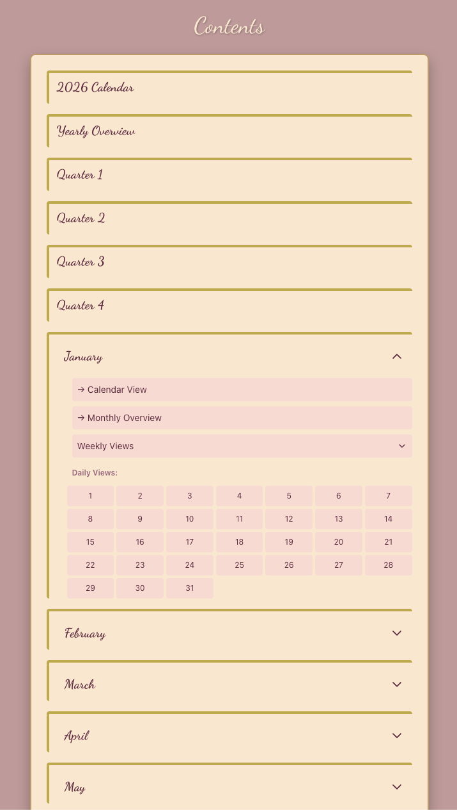
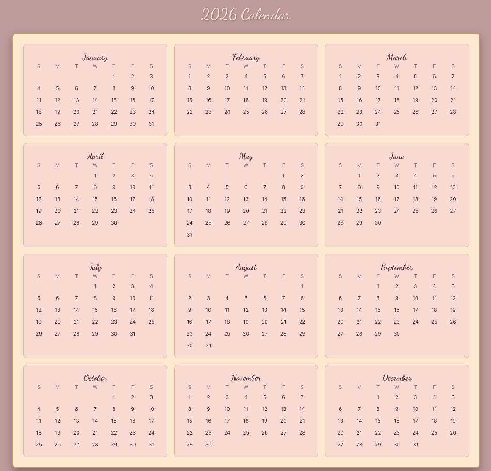
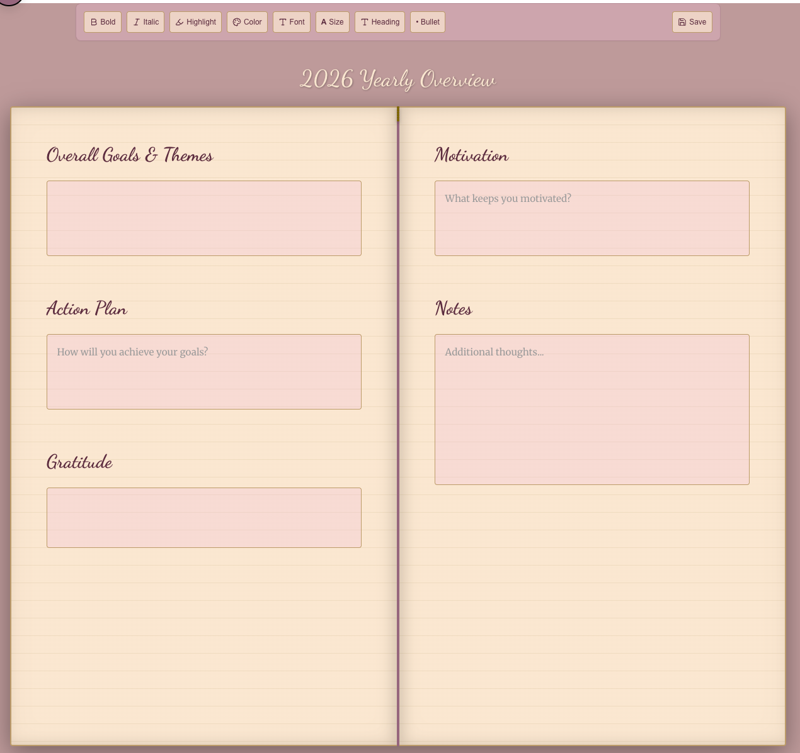
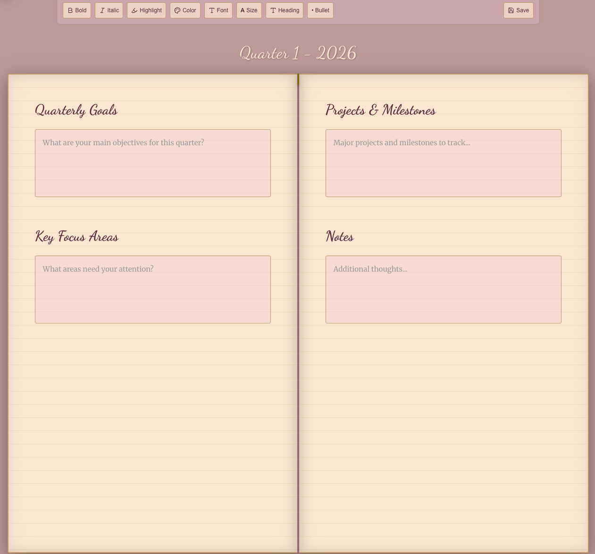
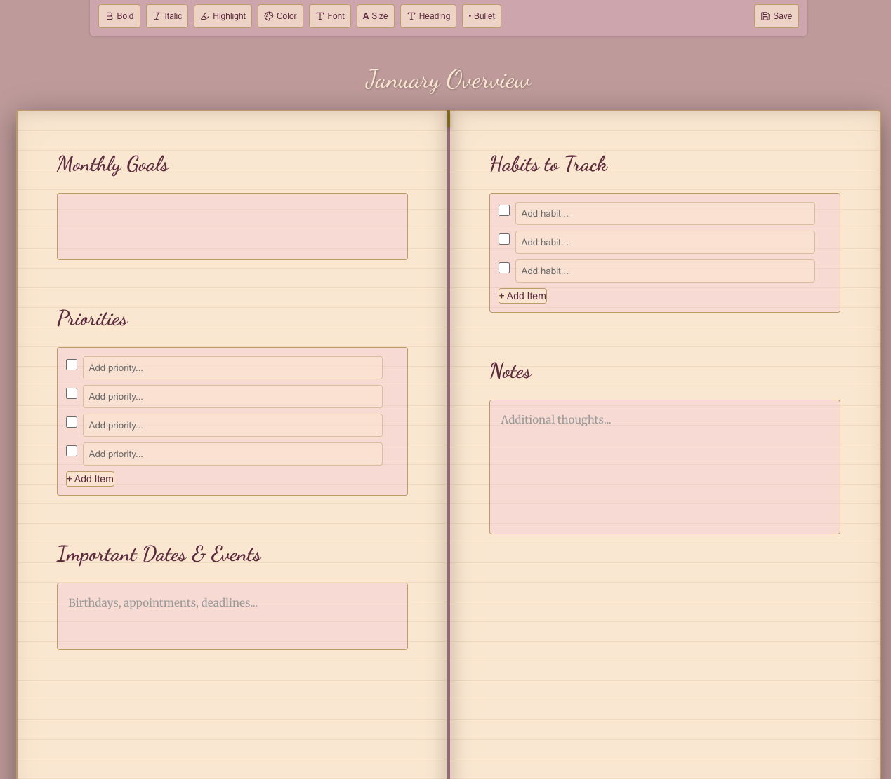
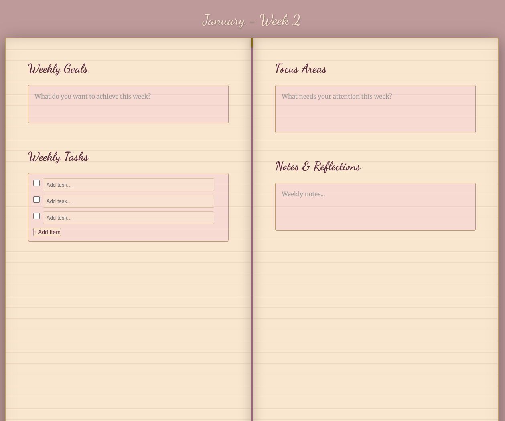
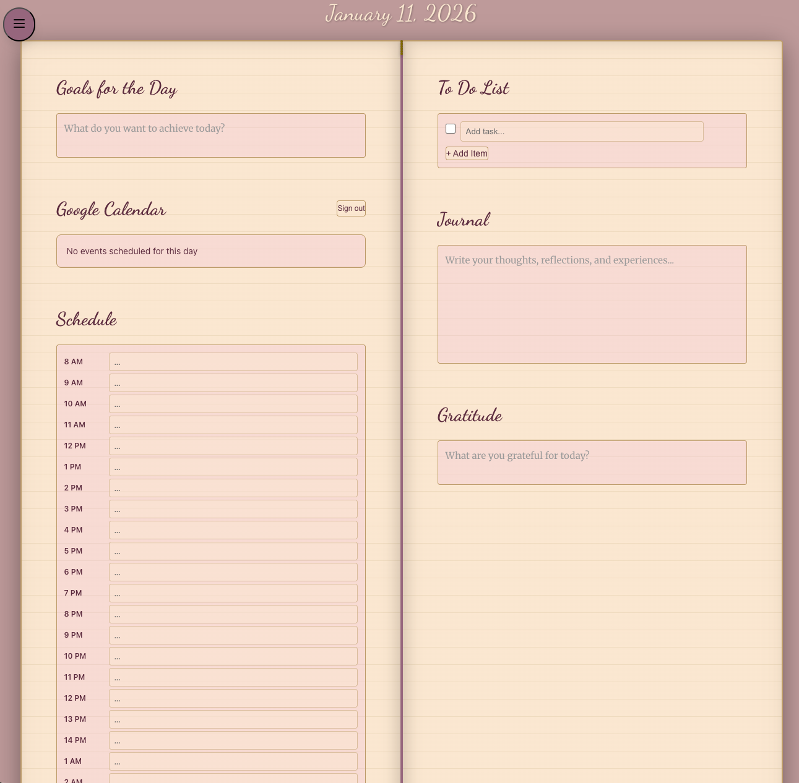
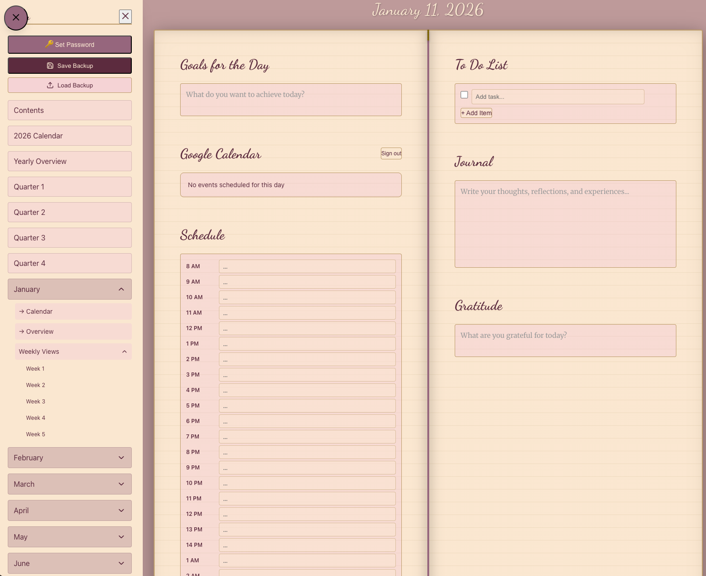

# Digital Planner 2026

A beautiful, feature-rich digital planner built with React for organizing your 2026 goals, schedules, and daily tasks.

## Features

- ✨ **Beautiful cover design** with custom planner artwork
- 📅 **Complete 2026 calendar** with yearly, quarterly, monthly, weekly, and daily views
- 📓 **Binder journal layout** - Two-page spread with gold binder rings and antique paper effect
- ✍️ **Text formatting** - Bold, italic, highlights, colors, font styles, font sizes, headings, and bullets
- 🎨 **Format Painter** - Copy formatting from one selection and apply to another
- 📝 **Rich note-taking** - Controlled textareas with instant updates
- ✅ **To-do lists** with checkboxes and themed styling
- 📋 **Copy tasks** - Copy individual tasks to another day with date picker
- 🔗 **Browser history** - Back/forward buttons work, bookmarkable URLs (e.g., `/#/day/3/15`)
- 🔄 **Cross-tab sync** - Edits in one tab automatically appear in other tabs
- 💾 **Auto-save** - All data saved to localStorage
- 🔐 **Encrypted backups** - Daily auto-backup with client-side encryption and password protection
- 📥 **Backup/Restore** - Download and upload your planner data as JSON
- 📆 **Google Calendar integration** - View your Google Calendar events on daily pages with session persistence
- 🎨 **Elegant color palette** - Mauve background, champagne paper, pink accents, and gold borders

## Screenshots

### Contents Page


### 2026 Calendar


### Yearly Overview


### Quarterly Overview


### Monthly Overview


### Weekly Overview


### Daily Overview


### Navigation Menu


## Prerequisites

- **Node.js** (version 16 or higher)
  - Download from: https://nodejs.org/
  - Verify installation: `node --version`
- **npm** (comes with Node.js)
  - Verify installation: `npm --version`

## Setup Instructions

### 1. Install Dependencies

Open a terminal/command prompt in the project directory and run:

```bash
npm install
```

This will install:
- React 18.2.0
- React DOM 18.2.0
- Lucide React (for icons)
- Vite (build tool)

### 2. Development Mode

To run the app in development mode with hot-reload:

```bash
npm run dev
```

The app will automatically open in your browser at `http://localhost:3000`

Any changes you make to the code will automatically reload in the browser!

### 3. Build for Production

To create an optimized production build:

```bash
npm run build
```

This creates a `dist` folder with optimized files ready for deployment.

### 4. Preview Production Build

To test the production build locally:

```bash
npm run preview
```

### 5. Static/Distributable Build

To create a distributable version that others can use without setting up Node.js:

```bash
# Build the static version
npm run build:static

# Serve it locally (opens browser at http://localhost:3001)
npm run serve:static
```

This creates a `dist-static` folder with all assets using relative paths. Share this folder with users who can then serve it using any simple HTTP server:

```bash
# Using npx (no install needed)
npx serve dist-static

# Using Python
cd dist-static && python -m http.server 8000
```

> **Note**: Due to browser security (CORS), the app requires a local HTTP server and cannot be opened directly via `file://` protocol.

## Google Calendar Integration (Optional)

To view your Google Calendar events on daily pages:

### Step 1: Get Google API Credentials

1. Go to [Google Cloud Console](https://console.cloud.google.com/)
2. Create a new project (or select an existing one)
3. Enable the **Google Calendar API**:
   - Navigate to "APIs & Services" → "Library"
   - Search for "Google Calendar API"
   - Click "Enable"
4. Create **OAuth 2.0 Client ID**:
   - Go to "APIs & Services" → "Credentials"
   - Click "Create Credentials" → "OAuth client ID"
   - If prompted, configure the consent screen (External, add your email)
   - Application type: **Web application**
   - Name: "Digital Planner 2026"
   - Authorized JavaScript origins: Add `http://localhost:3000`
   - Click "Create" and copy the **Client ID**
5. Create **API Key**:
   - Click "Create Credentials" → "API key"
   - Copy the **API key**

### Step 2: Configure Environment Variables

1. Copy the example environment file:
   ```bash
   cp .env.example .env
   ```

2. Edit `.env` and add your credentials:
   ```
   VITE_GOOGLE_CLIENT_ID=your-actual-client-id.apps.googleusercontent.com
   VITE_GOOGLE_API_KEY=your-actual-api-key
   ```

3. Restart the dev server:
   ```bash
   npm run dev
   ```

### Security Notes

- ⚠️ **Never commit `.env` to git** - it contains your API credentials
- The `.env` file is already in `.gitignore` to prevent accidental commits
- Only commit `.env.example` (which has placeholder values)
- Google Calendar integration uses **read-only access** - your app cannot modify your calendar
- You can revoke access anytime from your Google account settings

## Project Structure

```
planner-2026-react/
├── .env                 # Your API keys (DO NOT COMMIT)
├── .env.example         # Template for API keys (safe to commit)
├── .gitignore           # Prevents .env from being committed
├── index.html           # Main HTML file
├── package.json         # Project dependencies and scripts
├── vite.config.js       # Vite configuration
├── src/
│   ├── App.jsx          # Main planner component
│   ├── main.jsx         # React entry point
│   └── index.css        # Tailwind-like utility styles
└── README.md            # This file
```

## Usage

### Navigation
- Click the **Menu** button (top-left) to navigate between pages
- Use **breadcrumbs** to jump back to previous pages
- Click on month names to expand weekly and daily views
- **Browser back/forward** buttons work for navigation
- **Bookmark any page** - URLs like `/#/day/3/15` (March 15) can be bookmarked
- **Refresh preserves location** - Page state is maintained on browser refresh

### Text Formatting
Each page has a formatting toolbar at the top:
- **Bold**: `**text**`
- **Italic**: `_text_`
- **Highlight**: `==text==`
- **Color**: `~~text~~`
- **Heading**: `# text`
- **Bullet**: `- text`

### Data Management
- **Auto-save**: Changes are automatically saved to browser localStorage after 1 second
- **Download Backup**: Click "Download Backup" in the menu to save your data as JSON
- **Load Backup**: Click "Load Backup" to restore from a previously downloaded JSON file

### Sections Available
1. **2026 Calendar** - Year-at-a-glance view
2. **Yearly Overview** - Annual goals and themes
3. **Quarterly Views** - Q1-Q4 planning pages
4. **Monthly Calendar** - Calendar grid with daily notes
5. **Monthly Overview** - Monthly goals and priorities
6. **Weekly Views** - Week-by-week planning
7. **Daily Pages** - Detailed daily planner with schedule, to-dos, notes, and gratitude

## Customization

### Changing Colors
The planner uses an elegant color palette. Key colors to customize:
- **Background**: `#c6a4a4` (mauve)
- **Paper**: `#FBEAD6` (champagne)
- **Pink accent**: `rgba(242, 198, 222, 0.3)`
- **Text**: `#673147` (burgundy)
- **Borders**: `#C4A574` (gold)
- **Binder rings**: `#A17188` (mauve)

To customize:
1. Open `src/App.jsx` and component files in `src/components/`
2. Search for the hex codes above
3. Replace with your preferred colors

### Adding Pages
To add new pages:
1. Add a new condition in the render section of `App.jsx`
2. Create the page layout using the existing `Section`, `SimpleTextArea`, and other components
3. Add navigation in the `NavigationMenu` component

## Troubleshooting

### "npm: command not found"
- Install Node.js from https://nodejs.org/

### Port 3000 already in use
- Change the port in `vite.config.js`:
  ```javascript
  server: { port: 3001 }
  ```

### Changes not appearing
- Make sure you're in development mode (`npm run dev`)
- Check the browser console for errors
- Try clearing browser cache

### Data not saving
- Check that localStorage is enabled in your browser
- Data is stored per domain, so switching browsers/incognito mode will show different data

## IntelliJ IDEA Setup

1. **Open Project**: File → Open → Select the `planner-2026-react` folder
2. **Install Dependencies**: Right-click `package.json` → Run 'npm install'
3. **Run Development Server**: 
   - Open terminal in IntelliJ (Alt+F12 / ⌥F12)
   - Run: `npm run dev`
4. **Edit Files**: 
   - Main component: `src/App.jsx`
   - Styles: `src/index.css`
   - Enable JSX/React syntax highlighting if prompted

## License

MIT License - feel free to modify and use as needed!

## Support

For issues or questions:
1. Check the browser console for errors (F12)
2. Verify all dependencies are installed (`npm install`)
3. Try deleting `node_modules` and `package-lock.json`, then run `npm install` again
